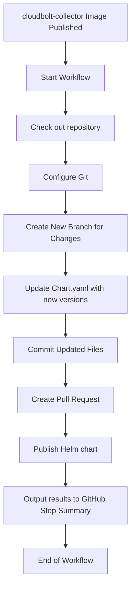

# cloudbolt-collector-helm

Deploys an application that will extract the cluster data and send it to cost platform.

## Requirements
- [Helm Chart](https://helm.sh/docs/)

To Install Helm Chart run these commands in your environment:
```console
curl -fsSL -o get_helm.sh https://raw.githubusercontent.com/helm/helm/main/scripts/get-helm-3
```
```console
chmod 700 get_helm.sh
```
```console
./get_helm.sh
```


## How to install this chart
Login to your OpenShift Cluster:

```console
oc login --username <username> <cluster-ip>:<cluster-port>
```
Clone the repo:

```console
git clone git@github.com:CloudBoltSoftware/cloudbolt-collector-helm.git
```

Change directory into the project (only if you have taken the GitHub pull):

```console
cd cloudbolt-collector-helm
```
Create a new namespace/project in cluster for adding new deployment with following command

```console
oc new-project cloudbolt-collector
```
Assigning UserID range is important for the namespace/project just created. Use below command to do that.

```console
oc annotate --overwrite namespace cloudbolt-collector openshift.io/sa.scc.uid-range='1000/1000' openshift.io/sa.scc.supplemental-groups='1000/1000'
```
Set the environmental variables required for Helm Chart deployment (If not present in the environment) :

```console
export IMAGE_VERSION="<release-version>" (By default "latest")
export OCP_IP="<openshift-cluster-ip>"
export OCP_PORT="<openshift-cluster-port>"
export OCP_SERVICENAME="<ocp-username>"
export OCP_ENABLE_SSL_VERIFICATION="<SSL Verification for http and https>"
export INGESTION_API_URL="<ingestion-api-url>"
```
To create a secret for OCP Password required for API, run below command
```console
oc create secret generic my-ocp-secret --from-literal=OCP_SERVICEPASS=<ocp-password> -n cloudbolt-collector
```
To create a secret for Ingestion API token required for API, run below command
```console
oc create secret generic cb-ingestion-token --from-literal=INGESTION_API_TOKEN=<ingestion-api-token> -n cloudbolt-collector
```
To install the chart with the environmental variables:

```console
helm install cloudbolt-collector-helm . --set IMAGE_VERSION=$IMAGE_VERSION,OCP_IP=$OCP_IP,OCP_PORT=$OCP_PORT,OCP_SERVICENAME=$OCP_SERVICENAME,OCP_ENABLE_SSL_VERIFICATION=$OCP_ENABLE_SSL_VERIFICATION,INGESTION_API_URL=$INGESTION_API_URL
```

## Release Pipeline
### Diagram

